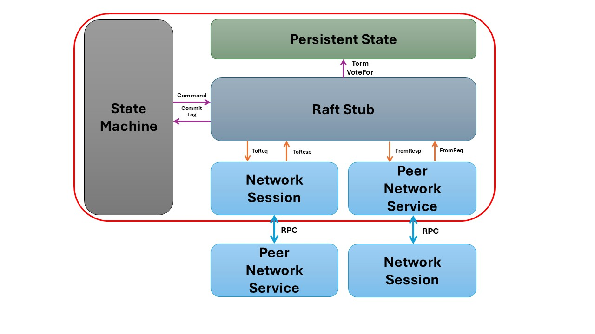

# Distributed Key-Value Store

## Overview

This project implements a distributed key-value store for CS739 Distributed Systems at UW Madison. 

It provides a scalable, partition-based architecture with support for basic key-value operations across multiple tables. The system features one-shot ACID transaction properties and supports Raft consensus protocol for fault-tolerant replicas.

## Architecture




## Supported Operations

The key-value store supports the following operations:

- `PUT <key> <value>`: Store a value for a given key
  - `PUT <key> found`: Key already exists, value updated
  - `PUT <key> not_found`: New key created
- `GET <key>`: Retrieve a value for a given key
  - `GET <key> <value>`: Success, returns value
  - `GET <key> null`: Key not found
- `SWAP <key> <new_value>`: Replace an existing value
  - `SWAP <key> <old_value>`: Success, returns old value
  - `SWAP <key> null`: Key not found
- `DELETE <key>`: Remove a key-value pair
  - `DELETE <key> found`: Success, key deleted
  - `DELETE <key> not_found`: Key doesn't exist
- `SCAN <start_key> <end_key>`: Retrieve keys and values within a range
- `STOP`: Gracefully terminate the client

**Key Format**: Keys are formatted as `table_name` followed by a numeric identifier (e.g., `customers123`, `products456`). Each table is independently partitioned across servers.

## Getting Started

### Running the Server

```bash
cargo run --release --bin server -- [OPTIONS]
```

#### Server Parameters

- `--partition-id <PARTITION_ID>`
  - Partition ID of the current node [default: 0]
  - Specifies which data partition this server instance manages

- `--replica-id <REPLICA_ID>`
  - Replica ID of the current node [default: 0]
  - Identifies this server within its replica set for consensus

- `-c, --client-listen-addr <CLIENT_LISTEN_ADDR>`
  - The address to listen on for client requests [default: 0.0.0.0:23000]
  - Endpoint where clients connect to issue queries and commands

- `-p, --peer-listen-addr <PEER_LISTEN_ADDR>`
  - The address to listen on for replica peer communication [default: 0.0.0.0:25000]
  - Used for Raft consensus protocol traffic between replicas

- `-d, --db-path <DB_PATH>`
  - Directory path for database files
  - Example: `data/db/partition<PARTITION_ID>/replica<REPLICA_ID>`

- `--log-path <LOG_PATH>`
  - Directory path for Raft log files
  - Example: `data/log/partition<PARTITION_ID>/replica<REPLICA_ID>`

- `--persistent-state-path <PERSISTENT_STATE_PATH>`
  - Directory path for Raft persistent state files
  - Example: `data/state/partition<PARTITION_ID>/replica<REPLICA_ID>`

- `--manager-addr <MANAGER_ADDR>`
  - Address of the cluster manager [default: 0.0.0.0:24000]
  - Used for coordination and discovery

- `--peer-replica-addr <PEER_REPLICA_ADDR>`
  - Comma-separated addresses of peer replicas [default: ""]
  - Format: `<replica_id>:<host>:<port>,<replica_id>:<host>:<port>,...`

- `--persistence`
  - Enable database persistence
  - When enabled, data is stored on disk; otherwise data exists only in memory

- `--batch-size <BATCH_SIZE>`
  - Batch size for write operations before flushing to disk
  - Larger values improve throughput at the cost of potential data loss on crash

- `--batch-timeout <BATCH_TIMEOUT>`
  - Timeout in milliseconds before a batch is flushed even if not full
  - Ensures writes are not delayed too long when traffic is light

- `--log-seg-entry-size <LOG_SEG_ENTRY_SIZE>`
  - Maximum size in bytes of each log segment file [default: 1048576]
  - Controls when new log segment files are created for better manageability

### Running the Manager

```bash
cargo run --release --bin manager -- [OPTIONS]
```

#### Manager Parameters

- `--listen-addr <LISTEN_ADDR>`
  - The address for the manager service to listen on [default: 0.0.0.0:24000]
  - Central endpoint that servers and clients connect to for coordination

- `--server-addrs <SERVER_ADDRS>`
  - Comma-separated list of KV server addresses
  - Format: `<host1>:<port1>,<host2>:<port2>,...`
  - Used to establish the initial cluster configuration

- `--tables <TABLES>`
  - Table configurations in format: table1=1000000,table2=2000000
  - Numbers represent the key space size for each table
  - Controls how data is partitioned across the cluster

- `--server-rf <SERVER_RF>`
  - The replication factor of a partition [default: 3]
  - Determines how many replicas exist for each data partition
  - Higher values increase fault tolerance but reduce write performance

- `--backer-path <BACKER_PATH>`
  - Path to durable storage directory under ./data/ (optional)
  - Enables persistent storage of cluster metadata and configuration

### Running the Client (Terminal Interaction)

```bash
cargo run --release --bin client -- [OPTIONS]
```

#### Client Parameters

- `--connect-addr <CONNECT_ADDR>`  The address to connect to [default: 0.0.0.0:24000]

### Running the Benchmark (Std In/Out)

```bash
cargo run --release --bin benchmark -- [OPTIONS]
```

#### Benchmark Parameters

- `--connect-addr <CONNECT_ADDR>`  The address to connect to [default: 0.0.0.0:24000]

## Command Line Interface

The client provides an interactive terminal where you can:

1. Start a command with `cmd`
2. Add operations with `op [operation] [args...]`
3. Execute the command with `done`
4. Toggle timing with `time`
5. Clear the screen with `clear`
6. Exit with `exit` or `quit`