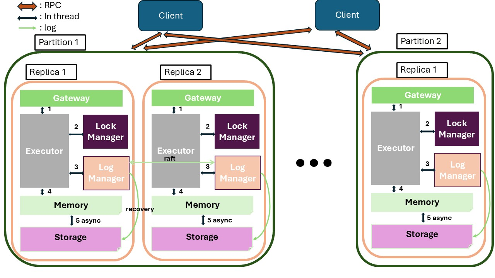

# Distributed Key-Value Store

## Overview

This project implements a distributed key-value store for CS739 Distributed Systems at UW Madison. 

It provides a scalable, partition-based architecture with support for basic key-value operations across multiple tables. The system features one-shot ACID transaction properties and is currently being extended to implement Raft consensus protocol for fault-tolerant replicas.

## Architecture



## Supported Operations

The key-value store supports the following operations:

- `PUT <key> <value>`: Store a value for a given key
  - `PUT <key> found`: Key already exists, value updated
  - `PUT <key> not_found`: New key created
- `GET <key>`: Retrieve a value for a given key
  - `GET <key> <value>`: Success, returns value
  - `GET <key> null`: Key not found
- `SWAP <key> <new_value>`: Replace an existing value
  - `SWAP <key> <old_value>`: Success, returns old value
  - `SWAP <key> null`: Key not found
- `DELETE <key>`: Remove a key-value pair
  - `DELETE <key> found`: Success, key deleted
  - `DELETE <key> not_found`: Key doesn't exist
- `SCAN <start_key> <end_key>`: Retrieve keys and values within a range
- `STOP`: Gracefully terminate the client

**Key Format**: Keys are formatted as `table_name` followed by a numeric identifier (e.g., `customers123`, `products456`). Each table is independently partitioned across servers.

## Getting Started

### Running the Server

```bash
cargo run --release --bin server -- [OPTIONS]
```

#### Server Parameters

- `--node-id <NODE_ID>`             Id of the current node [default: 0]
- `--listen-addr <LISTEN_ADDR>`      The address to listen on [default: 0.0.0.0:23000]
- `--db-path <DB_PATH>`              Directory path for database files
- `--log-path <LOG_PATH>`            Directory path for log files, e.g. `log<NODE_ID>`
- `--manager-addr <MANAGER_ADDR>`    Address of the manager [default: 0.0.0.0:24000]
- `--persistence`                    Enable database persistence
- `--batch-size <BATCH_SIZE>`        Batch size for write operations before flushing to disk
- `--batch-timeout <BATCH_TIMEOUT>`  Timeout in milliseconds before a batch is flushed even if not full

### Running the Manager

```bash
cargo run --release --bin manager -- [OPTIONS]
```

#### Manager Parameters

- `--listen-addr <LISTEN_ADDR>`  The address to listen on [default: 0.0.0.0:24000]
- `--servers <SERVERS>`          Comma-separated list of server addresses
- `--tables <TABLES>`            Table configurations in format: table1=1000000,table2=2000000

### Running the Client (Terminal Interaction)

```bash
cargo run --release --bin client -- [OPTIONS]
```

#### Client Parameters

- `--connect-addr <CONNECT_ADDR>`  The address to connect to [default: 0.0.0.0:24000]

### Running the Benchmark (Std In/Out)

```bash
cargo run --release --bin benchmark -- [OPTIONS]
```

#### Benchmark Parameters

- `--connect-addr <CONNECT_ADDR>`  The address to connect to [default: 0.0.0.0:24000]

## Command Line Interface

The client provides an interactive terminal where you can:

1. Start a command with `cmd`
2. Add operations with `op [operation] [args...]`
3. Execute the command with `done`
4. Toggle timing with `time`
5. Clear the screen with `clear`
6. Exit with `exit` or `quit`
 
## TODO List

- [x] Implement log manager
- [x] Add multi-table support with independent partitioning
- [ ] Add support for replicas (Raft)
- [x] Implement server recovery from log
- [x] heartbeat mechanism for leader election
- [ ] persist states {currentTerm, voteFor} and crash recovery